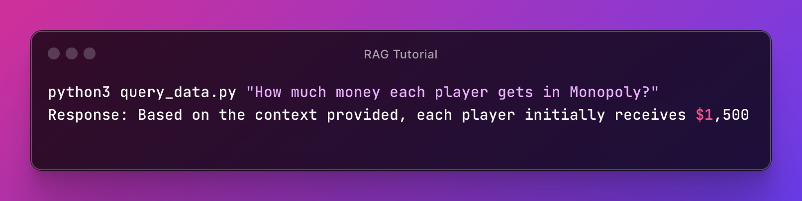

# RAG for PDFs using Ollama



See this [video](https://www.youtube.com/watch?v=2TJxpyO3ei4&ab_channel=pixegami) for more details.

## TOC

* [Features](#features)
* [TODO](#todo)
* [Known issues](#known-issues)
* [Install](#install)
* [Usage](#usage)

## Features

* embed sample documents in PDF format (from **data** folder)
* update embeddings if documents have changed
* results show reference to the source of information (document name + page + chunk ID)
* use purely OpenSource solutions:
  * [Ollama](https://github.com/ollama/ollama),
  * [llama2](https://huggingface.co/docs/transformers/model_doc/llama2),
  * [ChromaDB](https://www.trychroma.com/),
  * [langchain](https://python.langchain.com/docs/get_started/introduction)
* unit tests using pytest

## Todo

* model selection should be possible as command line parameter
* add debug mode to print more info
* add web UI (e.g. [Gradio](https://www.gradio.app/))
* thanks to [langchain](https://python.langchain.com/docs/get_started/introduction) it should be easy to use other file [formats](https://python.langchain.com/docs/modules/data_connection/document_loaders/):
  * Office
  * csv
  * HTML
  * json
  * Markdown
  * or even more with [Document loaders](https://python.langchain.com/docs/integrations/document_loaders/)
    * AWS/Azure/Google Cloud
    * Confluence
    * git
    * Slack

## Known issues

### Results aren't deterministic

They depend on:

* chat model and embeddings model it self
* the size of the model (the bigger model, the slower but better results, but RAM is the limit)
* the quality of input documents

With llama2:7b (nomic-embed-text), the basic question fails:

`How much money each player gets at start playing Monopoly?`

With llama2:13b (nomic-embed-text), the basic question succeeds, but a slightly more difficult one fails:

`"How much money in total each player gets at start playing speed die rules in Monopoly?"`

### Unit tests are using LLM model to check if the answer from the same model is correct

**The problem:**

Since model answers in natural language, each time we can get different answer. Usually the answer has the same meaning, but is formulated differently.

For example, given this question:

`How much money each player gets at start playing Monopoly?`

We might get following answers:

* `Each player is given $1,500`
* `Each player is initially given $1,500`
* `$1,500`
* `1,500 USD`

**The solution from original repo:**

Ask the model if provided answer (`Each player is given $1,500`) is equivalent to expected answer (`$1,500`).

**The concern:**

This seems not logical - LLM model should not be used to tell if the model is correct or not.
This works, but potentially can lead to problems.

**Alternative solution:**

One might try tu use **function calling** with custom prompt to get results in precise format.

It's still not perfect, since we still would be using the model to test itself, only in a more strict form.

### Interesting observations, when using **mistral**

`python3 query_data.py "How much money each player gets in total at start, when playing speed die rules in Monopoly?"`

`Response:  Each player receives $1,000 in addition to their initial money when using the Speed Die rules in Monopoly. This is stated in the text twice for clarification. So, the total amount of money each player begins with is the sum of their starting money and this additional $1,000. The specific starting money for each player isn't mentioned in the context, but it is generally $1,500 for each player in Monopoly when playing by the classic rules.`

This sentence is very interesting:

`The specific starting money for each player isn't mentioned in the context, but it is generally $1,500 for each player in Monopoly when playing by the classic rules.`

This means 2 things:

* the embeddings generation or retrieval must be wrong
* models have their own knowledge on games like Monopoly so in their answer we might get a mix of information from our documents and general knowledge.

The later one is something to keep in mind, when you query about topic related to public domain.

To test models it might be a good idea to ask about something that is only in the documents and doesn't interfere with general knowledge.

E.g.:

`What is the p.o. box of Hasbro Games?`

### Interesting observations, when using **wizardlm2**

`One $1 note (although this is mentioned as "Is" in the context, it seems to be a typo and should be "$1")`

Perhaps the data retrieval from pdf is not working properly.

## Install

```bash
# create venv
python3 -m venv .venv
# activate it
# on Linux/MacOS
source .venv/bin/activate
# on Windows
.venv\Scripts\activate

# install packages
pip install -r requirements.txt
```

## Usage

1. Install Ollama

    [link](https://ollama.com/download)

1. Pull models

    This can take a while, since models take from 4 to 8 GB

    ```bash
    ############################################################
    ### chat LLM models
    ############################################################
    # one is enough to start
    # change OLLAMA_MODEL in query_data.py

    # basic llama 2 7B model (3.8 GB)
    ollama pull llama2
    
    # slower but better llama 2 13b model (and bigger: 7.4 GB)
    ollama pull llama2:13b
    
    # freshly released (18-04-24) llama 3 8B model (4.7 GB) - NOT WORKING for now
    ollama pull llama3

    # same size as llama2:7b, but performance of llama2:13b (4.1 GB)
    ollama pull mistral

    # fastest model, comparable performance with 10x larger open-source models (7b 4.1 DB)
    ollama pull wizardlm2
    
    ############################################################
    ### embedding models 
    ############################################################
    # one is enough to start
    # change OLLAMA_EMBEDDINGS_MODEL in get_embedding_function.py and clear DB
    
    # 334M params 700 MB
    ollama pull snowflake-arctic-embed

    # 137M params 274 MB
    ollama pull nomic-embed-text
    
    # 23M params 46 MB
    ollama pull all-minilm

    ############################################################
    ### additional supporting commands
    ############################################################
    # list models (and how much space on disk they occupy)
    ollama list

    # test model in command line (simple chat)
    ollama run wizardlm2

    # optional - preview requests and responses (run in separate terminal)
    # first close the ollama app using icon in tray, next run this command
    ollama serve 

    # remove model
    # ollama rm <model_name>
    ```

1. Populate DB with data

    ```bash
    python3 populate_database.py

    # optionally you can clear the whole DB
    # (useful when changing embeddings model)
    # python3 populate_database.py --reset
    ```

1. Query the documents

    ```bash
    python3 query_data.py "How much money each player gets in Monopoly?"
    ```

1. Run unit tests

    Results aren't unfortunately deterministic.

    ```bash
    pytest --disable-warnings test_rag.py
    ```
